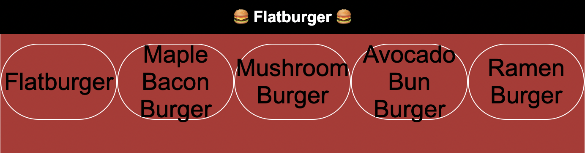

# Phase 1 Coding / Whiteboard Challenge: Flatburger

Flatiron's Burger Restaurant is open for business! You will be adding a feature to the frontend for our app, Flatburger.

> To view in VSCode, right click on the README.md file and select "Open Preview".

## Demo

Use this image as an example of how the app should look once it is complete.

## Setup

Open the `index.html` file on your browser to run the application.

Write your code in the `src/index.js` file.

## What You Already Have

In `src/index.js`, there are burger names provided in an array stored in a variable named `burgerNames`.

## Deliverable

- For each of the burger names in the `burgerNames` array, create a `span` tag with the name of the burger and add it to the `div` element with the id of `restaurant-menu`.